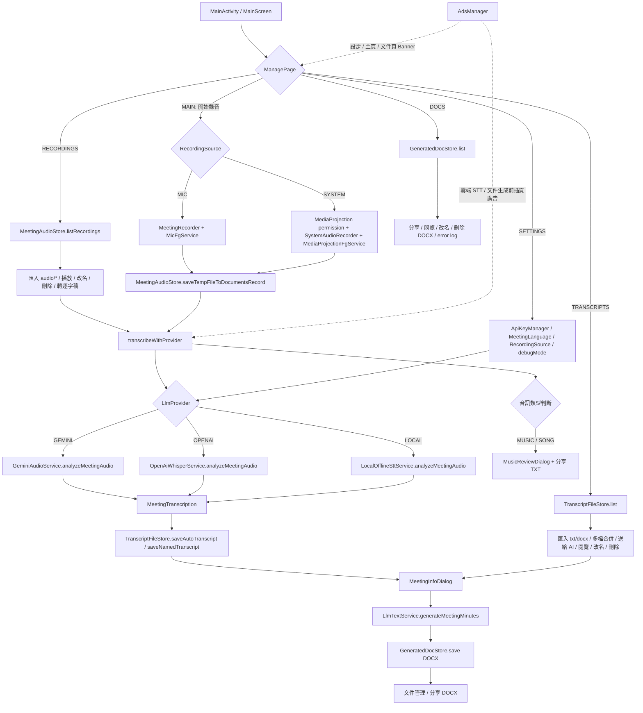
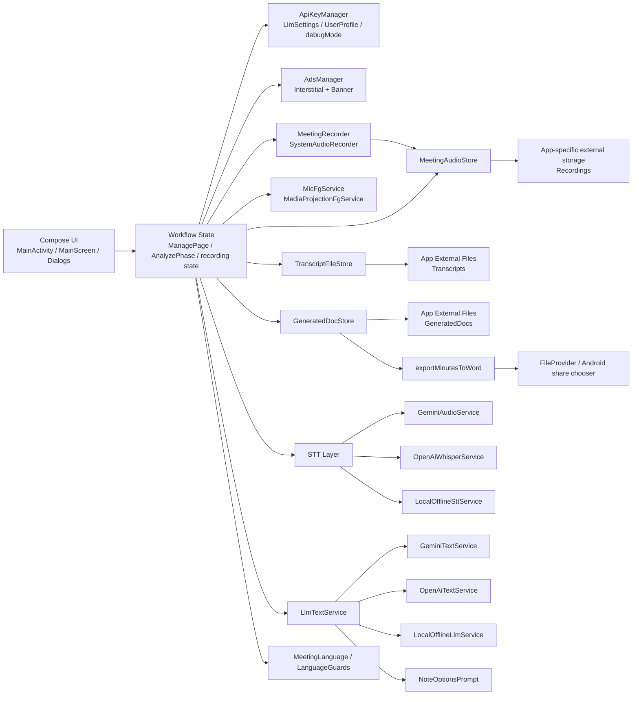

# GeminiMeetingNotes

GeminiMeetingNotes 是一個主打「錄音轉逐字稿，再把逐字稿整理成文件」的 Android 工具，提供「錄音 → 逐字稿 → AI 文件產生 → 檔案管理與分享」的一站式流程。

核心價值不是只有錄音，而是把長時間音訊整理成可交付文件：
- 支援錄音後直接轉逐字稿，也可匯入既有錄音或文字稿再整理。
- 逐字稿可再交給 AI 轉成會議記錄、上課筆記、行動清單、決策紀錄、主管摘要等文件。
- 依目前實測，在 Gemini 免費額度可用的情況下，曾完成超過 3 小時錄音的轉錄流程。
- 產出結果可直接匯出為 `docx` 並分享。

---

## 0) 產品定位與主要賣點

這個 APP 的定位不是單一錄音機，而是 **錄音轉逐字稿，再把逐字稿轉成正式文件** 的整理工具。

### 最值得強調的賣點
- **長錄音也能處理**：依目前實測，在 Gemini 免費額度可用時，曾完成超過 3 小時錄音的轉逐字稿流程。
- **錄音可直接整理成文件**：不只產出逐字稿，還能整理成可交付的 `docx` 文件。
- **一站式流程**：從錄音、逐字稿、AI 整理、文件輸出與分享都在同一個 APP 完成。
- **適用場景不只會議**：也能整理課程內容、訪談、心得、決策追蹤與主管摘要。

> 備註：可處理時長與是否仍可免費使用，會受模型方案、API 額度、網路狀況與服務端政策影響；README 這裡僅保留目前實測結果，不保證未來永久固定。

---

## 1) APP 功能說明

### 核心功能
- 會議錄音
  - 支援 `MIC` 與 `SYSTEM` 兩種錄音來源。
  - 錄音檔儲存於 app-specific external storage 的 `Recordings` 目錄，避免被一般音樂播放器誤列入清單。
- 逐字稿處理
  - 可將錄音送出做語音轉文字。
  - 可處理長時間錄音；依目前實測，在 Gemini 免費額度可用時，曾完成超過 3 小時錄音的轉逐字稿流程。
  - 可從文字檔匯入逐字稿（`txt` / `docx`）。
- AI 文件產生
  - 依「文件風格 / 內容長度 / 輸出章節」產生文件內容。
  - 支援會議記錄、上課筆記、心得報告、行動清單、決策紀錄、主管摘要。
- 文件輸出與分享
  - 文件輸出為 `docx`。
  - 產生後可直接透過 Android share chooser 分享到其他 APP 或雲端硬碟。
  - 支援分享錄音檔、逐字稿、產生文件。
- 檔案管理
  - 錄音檔管理：播放/開啟、重命名、刪除、轉逐字稿、匯入錄音。
  - 逐字稿管理：匯入、檢視、重命名、刪除、匯出分享。
  - 文件管理：檢視、分享、刪除。

### AI Provider
- `GEMINI`
- `OPENAI`
- `LOCAL`（離線流程預留）

---

## 2) APP 操作說明

### 初次使用
1. 開啟 APP。
2. 進入設定頁確認 `AI Provider`、`Model`、`API Key`（建議預設 `gemini-3.1-flash-lite-preview`）。
3. 選擇錄音來源（`MIC` 或 `SYSTEM`）。
4. 首頁會顯示錄音 → 逐字稿 → 文件流程摘要，並強調依目前實測可處理超過 3 小時錄音。

### 標準流程（從錄音到文件）
1. 在主頁按「開始錄音」或從錄音檔管理匯入 `audio/*`。
2. 結束錄音後，系統開始轉逐字稿；若已有逐字稿，也可直接匯入 `txt` / `docx`。
3. 進入「確認文件資訊」：
   - 輸入文件名稱。
   - 確認說話者名稱。
   - 選擇文件風格與內容長度（章節選項已簡化為系統預設）。
5. 按「送出給 AI」產生內容。
6. 在結果視窗按「匯出 Word」後，會開啟 Android share chooser：
   - 可分享到其他 APP
   - 可儲存到雲端硬碟

### 其他操作
- 逐字稿頁可匯入 `txt` / `docx`。
- 錄音檔頁可匯入 `audio/*`。
- 文件管理頁可直接分享既有文件，不重複生成。


### 文件風格（目前可用）
- 會議記錄（`STANDARD`，輸出 `DOCX`）
- 上課筆記（`ACTION_FOCUSED`，輸出 `DOCX`）
- 心得報告（`BRIEFING`，輸出 `DOCX`）
- 行動清單（`ACTION_ITEMS_REPORT`，輸出 `DOCX`）
- 決策紀錄（`DECISION_LOG`，輸出 `DOCX`）
- 主管摘要（`EXECUTIVE_SUMMARY`，輸出 `DOCX`）

### 文件風格快速教學
- 會議記錄：適合完整留存會議內容與後續追蹤。
- 上課筆記：適合整理概念、重點與複習清單。
- 心得報告：適合觀察 + 分析 + 建議的反思型文件。
- 行動清單：適合把逐字稿轉為可執行任務列表（Task/Owner/Deadline）。
- 決策紀錄：適合保留決策理由、替代方案與影響範圍。
- 主管摘要：適合 1–2 頁高密度重點，提供主管快速決策。

---

## 3) APP 流程圖



---

## 4) 架構圖



---

## 5) 檔案說明（重點）

- `app/src/main/java/com/example/geminimeetingnotes/MainActivity.kt`
  - 主流程控制中心，包含 `ManagePage` 頁面切換、錄音啟停、逐字稿匯入、多檔合併送 AI、文件產生、檔案管理、設定頁與廣告觸發。
- `app/src/main/java/com/example/geminimeetingnotes/MeetingInfoDialog.kt`
  - 「確認文件資訊」對話框，負責文件名稱、說話者名稱修正、`NoteStyle` / `NoteLength` / 自訂指示。
- `app/src/main/java/com/example/geminimeetingnotes/MeetingMinutesDialog.kt`
  - AI 產生內容預覽與匯出入口；目前對外文件流程以 `DOCX` 為主。
- `app/src/main/java/com/example/geminimeetingnotes/MeetingAudioStore.kt`
  - 錄音檔在 app-specific external storage 的 `Recordings` 目錄儲存、列舉、匯入與刪除；避免被一般音樂播放器誤掃描。
- `app/src/main/java/com/example/geminimeetingnotes/TranscriptFileStore.kt`
  - 逐字稿的自動命名、具名儲存、匯入、重新命名、列舉與刪除；存放於 App 專屬 `Transcripts` 目錄。
- `app/src/main/java/com/example/geminimeetingnotes/GeneratedDocStore.kt`
  - 文件與 error log 落地儲存；目前 README 以對外使用中的 `docx` 與 `error_log_*.txt` 為主說明。
- `app/src/main/java/com/example/geminimeetingnotes/ApiKeyDataStore.kt`
  - `LlmProvider`、`modelName`、`API Key`、`debugMode`、使用者資料與其他設定的持久化設定。
- `app/src/main/java/com/example/geminimeetingnotes/audio/MeetingRecorder.kt`
  - `MIC` 錄音實作。
- `app/src/main/java/com/example/geminimeetingnotes/audio/SystemAudioRecorder.kt`
  - `SYSTEM` 錄音實作，搭配 `MediaProjection` 與麥克風混音流程。
- `app/src/main/java/com/example/geminimeetingnotes/network/GeminiAudioService.kt`
  - Gemini 音訊分析、說話者辨識、音樂/歌曲分類與 debug error log 產生。
- `app/src/main/java/com/example/geminimeetingnotes/network/OpenAiWhisperService.kt`
  - OpenAI 語音轉文字與說話者資訊封裝。
- `app/src/main/java/com/example/geminimeetingnotes/network/LlmTextService.kt`
  - 文件生成入口，依 provider 切到 Gemini / OpenAI / 本地離線文字流程。
- `app/src/main/java/com/example/geminimeetingnotes/network/PptxExportBackendService.kt`
  - 舊簡報匯出路徑保留中的 backend 串接模組；目前 APP 對外功能不以此流程為主。
- `app/src/main/java/com/example/geminimeetingnotes/offline/LocalOfflineServices.kt`
  - 本地離線模式的 STT / LLM placeholder 流程。
- `app/src/main/java/com/example/geminimeetingnotes/AdsManager.kt`
  - 插頁廣告與 Banner 廣告的初始化、預載與顯示。
- `app/src/main/res/values/strings.xml`
  - 繁中 UI 文案與操作提示。
- `app/src/main/res/values-en/strings.xml`
  - 英文 UI 文案。

---

## 6) 待處理問題（Known Issues）

- README 已改為以目前對外功能為準，因此**不將簡報 / `PPTX` 視為現行功能**；但程式碼中仍可見相關殘留模組，後續若不再使用可再評估清理。
- `LOCAL` 模式目前是 placeholder 流程，雖可走完整 UI 與 service 分流，但實際效果仍屬預留狀態。
- 大型錄音檔上傳與模型處理時間可能較長，仍需持續觀察 timeout / retry 策略與錯誤記錄品質。
- 不同品牌 Android 對 `MediaStore` 權限、刪除授權與 `MediaProjection` 行為可能有差異，需持續實機驗證。
- `MainActivity.kt` 目前承載大量 UI、workflow、檔案操作與 provider 分流邏輯，後續仍有拆分壓力。

---

## 7) 未來可增加功能與走向

### 產品功能
- 支援多種文件格式：`pdf`、`md`、`html`。
- 會議模板庫（部門會議、專案週會、課堂摘要、訪談紀錄）。
- 自動產出 `Action Items` 給任務工具（Jira/Notion/Trello）。
- 說話者辨識後處理（合併別名、角色標記）。

### 技術方向
- 文件輸出策略抽象化（`DocumentExporter` 介面），降低 `MainActivity` 耦合。
- 背景任務與佇列化（WorkManager），提升長任務穩定性。
- 引入更完整的 error telemetry 與可觀測性。

### 維運方向
- 補齊端對端測試（錄音 -> STT -> 文件輸出）。
- 新增資料清理策略（暫存檔、過舊文件清理）。

---

## 8) 開發與建置

### Java 版本要求
- 建議使用 `JDK 17`（可用 `JDK 21`，但不建議 `JDK 25`）。
- 若使用較新版本（例如 `JDK 25`）可能出現 Kotlin/Gradle 腳本解析錯誤（例如 `25.0.1`）。

### Windows 環境（建議）
1. 設定環境變數：
   - `JAVA_HOME=C:\Program Files\Eclipse Adoptium\jdk-17.x.x-hotspot`
   - `ANDROID_HOME=C:\Users\Admin\AppData\Local\Android\Sdk`
2. 建議複製 `local.properties.example` 為 `local.properties`，並確認：
   - `sdk.dir=C\\:\\Users\\Admin\\AppData\\Local\\Android\\Sdk`
   - 若未建立 `local.properties`，專案會嘗試以 `ANDROID_SDK_ROOT` 或 `ANDROID_HOME` 自動產生。
3. 開新 terminal 後執行：

```bat
gradlew.bat --stop
java -version
echo %JAVA_HOME%
echo %ANDROID_HOME%
gradlew.bat assembleDebug --no-daemon --stacktrace
gradlew.bat test --no-daemon --stacktrace
```

### macOS / Linux
```bash
./gradlew --stop
java -version
echo "$JAVA_HOME"
echo "$ANDROID_HOME"
./gradlew assembleDebug --no-daemon --stacktrace
./gradlew test --no-daemon --stacktrace
```

> 若遇到 `SDK location not found`，請優先檢查 `local.properties` 的 `sdk.dir` 是否正確。
